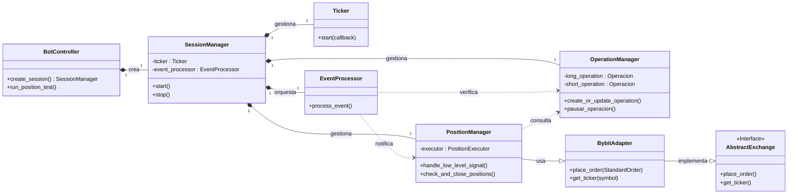
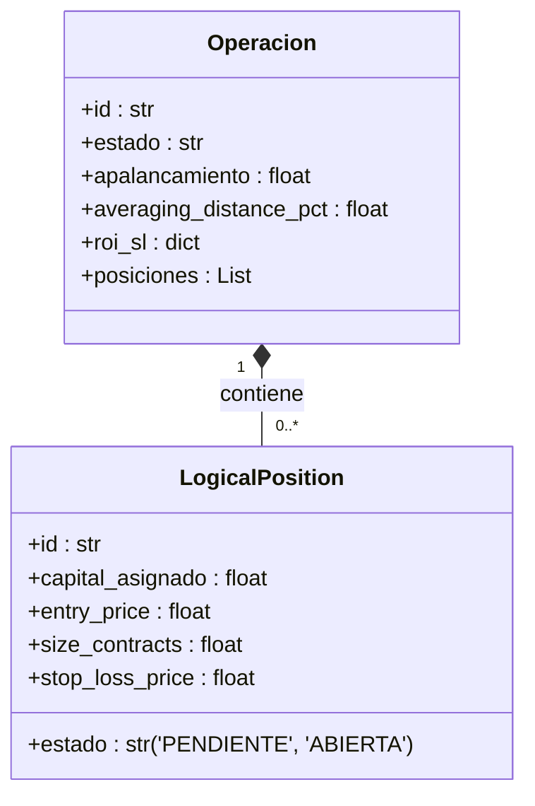

# Python Trading Bot - Arquitectura de Software Avanzada

![GIF de la TUI en acción] <!-- ¡IMPORTANTE! Graba un GIF de tu bot funcionando y ponlo aquí. Es lo más impactante. -->

Un bot de trading algorítmico para Bybit construido en Python, enfocado en una **arquitectura modular, escalable y robusta**. Este proyecto es una demostración práctica de principios de diseño de software como la Inyección de Dependencias, el Patrón Adaptador y la Separación de Responsabilidades, todo controlado a través de una completa Interfaz de Usuario en Terminal (TUI).

> ### **Advertencia de Seguridad y Riesgo**
> **EL TRADING DE FUTUROS CON APALANCAMIENTO ES EXTREMADAMENTE RIESGOSO Y PUEDE RESULTAR EN LA PÉRDIDA TOTAL DE SU CAPITAL.**
> Este software se proporciona "tal cual", sin ninguna garantía. El autor no se hace responsable de ninguna pérdida financiera. **Nunca** ejecute este bot en una cuenta real sin haberlo probado extensivamente en **TESTNET**.

---

## ✨ Características Clave

*   **Interfaz de Usuario en Terminal (TUI):** Menús interactivos construidos con `simple-term-menu` para controlar el bot en tiempo real, configurar estrategias, monitorear el rendimiento y visualizar logs.
*   **Arquitectura en Capas Limpia:** Clara separación entre la capa de Presentación (TUI), la Lógica de Negocio (Estrategia) y el Acceso a Datos (API), facilitando el mantenimiento y la escalabilidad.
*   **Gestión de Estrategia Modular:** Permite configurar y ejecutar estrategias complejas (ej. promediación de costos) con múltiples posiciones lógicas, límites de riesgo (SL/TP/TSL) y condiciones de entrada/salida personalizables.
*   **Abstracción del Exchange (Patrón Adaptador):** Diseñado con una interfaz (`AbstractExchange`) que independiza la lógica del bot del exchange. La implementación actual para Bybit (`BybitAdapter`) podría ser reemplazada o extendida para otros exchanges con un esfuerzo mínimo.
*   **Manejo de Cuentas Múltiples:** Orquesta operaciones y transferencias entre subcuentas dedicadas (main, longs, shorts, profit) para un aislamiento de riesgo y una gestión de capital superior.
*   **Configuración en Caliente ("Hot Reload"):** Permite ajustar parámetros críticos de la estrategia (indicadores de TA, configuración de riesgo) durante una sesión de trading activa, sin necesidad de reiniciar el bot.
*   **Logging Asíncrono y Detallado:** Registra señales, posiciones cerradas e instantáneas de sesión en archivos `.jsonl` para un análisis y auditoría posterior, sin bloquear el hilo principal.

## 🛠️ Stack Tecnológico y Principios de Diseño

*   **Lenguaje:** Python 3.10+
*   **Librerías Principales:** `pybit`, `pandas`, `numpy`, `simple-term-menu`, `python-dotenv`
*   **Principios de Diseño Aplicados:**
    *   **Arquitectura Limpia (Clean Architecture):** Flujo de dependencias claro hacia el núcleo del negocio.
    *   **Inyección de Dependencias (DI):** Las clases reciben sus dependencias en lugar de crearlas, lo que facilita las pruebas y la modularidad.
    *   **Patrón Fachada (Facade):** Módulos `_api.py` que exponen una interfaz simple para subsistemas complejos (PM, OM, SM).
    *   **Patrón Adaptador (Adapter):** La capa `core/exchange` que desacopla el bot de la implementación específica de Bybit.
    *   **Separación de Responsabilidades (SoC):** Cada clase y módulo tiene un propósito bien definido (ej. `PositionExecutor` solo ejecuta, `_calculator` solo calcula).

## 📐 Arquitectura y Modelo de Datos

Este proyecto no es solo un script, sino un sistema de software diseñado con una arquitectura en capas bien definida. Los siguientes diagramas ilustran la estructura, el flujo de datos y las relaciones entre los componentes clave.

### 1. Diagrama de Arquitectura de Capas

Este diagrama muestra la visión de alto nivel del sistema, organizado según los principios de **Arquitectura Limpia (Clean Architecture)**. Cada capa tiene una responsabilidad clara, y las dependencias fluyen hacia el interior (hacia la lógica de negocio), lo que hace que el sistema sea modular, comprobable y fácil de mantener.

```mermaid
graph TD
    subgraph "Capa de Presentación"
        TUI["💻 Interfaz de Usuario en Terminal (TUI)"]
    end

    subgraph "Capa de Control de Aplicación"
        BotController["🤖 BotController (Gestor Principal)"]
        SessionManager["📈 SessionManager (Gestor de Sesión)"]
    end

    subgraph "Capa de Lógica de Negocio (Estrategia)"
        OM["🧠 OperationManager (OM)"]
        PM["📊 PositionManager (PM)"]
        TA_Signal["🔬 TA Manager & Signal Generator"]
    end

    subgraph "Capa de Abstracción del Exchange"
        style Adapter fill:#f9f,stroke:#333,stroke-width:2px
        Adapter["🔌 BybitAdapter (Traductor)"]
    end

    subgraph "Capa de Infraestructura"
        API["📡 core/api & ConnectionManager"]
        Bybit["🏦 Exchange (Bybit API)"]
    end

    %% --- Conexiones y Flujo de Control ---
    TUI -- "Acciones del Usuario" --> BotController
    BotController -- "Crea/Inicia Sesión" --> SessionManager
    SessionManager -- "Orquesta Eventos de Precio" --> TA_Signal
    SessionManager -- "Pasa Señales y Ticks" --> PM
    OM -- "Define Estrategia y Estado" --> PM
    TA_Signal -- "Genera Señal (BUY/SELL)" --> PM
    PM -- "Ejecuta Orden (Abrir/Cerrar)" --> Adapter
    Adapter -- "Traduce a llamada API" --> API
    API -- "Comunica con" --> Bybit
```



### 2. Diagrama de Flujo de Datos (Ciclo de Vida de un Tick)

Este diagrama de secuencia ilustra la **interacción dinámica** entre los componentes clave cuando se recibe un nuevo tick de precio. Muestra paso a paso cómo la información fluye a través del sistema, desde la obtención del precio hasta la posible ejecución de una orden.

```mermaid
sequenceDiagram
    participant Ticker
    participant SessionManager as SM
    participant EventProcessor as EP
    participant TAManager as TA
    participant SignalGenerator as Signal
    participant PositionManager as PM
    participant ExchangeAdapter as Adapter

    loop Cada 'N' segundos
        Ticker->>SM: 1. Nuevo Precio Obtenido
        SM->>EP: 2. Procesa Evento de Precio
        
        EP->>TA: 3. Añade Tick y Calcula Indicadores
        TA-->>EP: 4. Devuelve Indicadores (EMA, etc.)
        
        EP->>Signal: 5. Evalúa Indicadores con Reglas
        Signal-->>EP: 6. Devuelve Señal (BUY/SELL/HOLD)
        
        EP->>PM: 7. Notifica Señal y Precio Actual
        
        alt La señal es BUY/SELL y las condiciones se cumplen
            PM->>Adapter: 8. Orden de Apertura (StandardOrder)
            Adapter-->>PM: 9. Respuesta de la API
        end

        alt Las condiciones de SL/TSL se cumplen
            PM->>Adapter: 8. Orden de Cierre (StandardOrder)
            Adapter-->>PM: 9. Respuesta de la API
        end
    end
```



### 3. Modelo de Clases (Diagrama de Clases UML Simplificado)

Este diagrama muestra las **clases más importantes** del sistema y sus relaciones (composición, herencia, asociación). Refleja la estructura orientada a objetos del proyecto y cómo las responsabilidades se encapsulan en diferentes clases.



### 4. Modelo de Entidades de Dominio (Estructuras de Datos)

Estas son las **estructuras de datos centrales** que representan los conceptos de negocio del bot. La lógica de la aplicación opera sobre estas entidades, que se mantienen desacopladas de cualquier detalle de implementación externa.

*   **`Operacion`**: Representa una estrategia completa para un lado del mercado (LONG o SHORT). Contiene toda la configuración de la estrategia y la lista de sus posiciones.
*   **`LogicalPosition`**: Representa un "lote" de capital individual que puede ser invertido. Es la unidad atómica de trading que el `PositionManager` gestiona.



## 🚀 Puesta en Marcha

Sigue estos pasos para configurar y ejecutar el bot en tu máquina local.

### 1. Prerrequisitos
-   Python 3.10 o superior.
-   Una cuenta en [Bybit](https://www.bybit.com/).

### 2. Instalación
1.  **Clonar el repositorio:**
    ```bash
    git clone https://github.com/zantgo/bybit-futures-bot-67.git
    cd tu-repositorio
    ```

2.  **Crear y activar un entorno virtual:**
    ```bash
    python -m venv venv
    # En Windows:
    .\venv\Scripts\activate
    # En macOS/Linux:
    source venv/bin/activate
    ```

3.  **Instalar las dependencias:**
    ```bash
    pip install -r requirements.txt
    ```

### 3. Configuración en Bybit y `.env`

El bot utiliza subcuentas para una gestión de riesgo aislada.

1.  **Crea Subcuentas en Bybit:**
    *   En tu panel de Bybit, ve a "Subcuentas" y crea tres subcuentas de tipo **"Cuenta de Trading Unificado"**. Nómbralas `longs`, `shorts`, y `profit`.
    *   Anota el **UID** de cada una de estas subcuentas.

2.  **Genera las Claves API:**
    *   **Cuenta Principal:** Crea una clave API con permisos **Leer/Escribir** para **Activos -> Transferencia**.
    *   **Subcuentas (`longs`, `shorts`, `profit`):** Para cada una, crea una clave API con permisos **Leer/Escribir** para **Contrato -> Trading Unificado**.

3.  **Configura el archivo `.env`:**
    *   Crea una copia del archivo de ejemplo: `cp .env.example .env` (o `copy .env.example .env` en Windows).
    *   Abre el archivo `.env` y rellena **todas** las variables con tus claves API y UIDs.

4.  **Deposita Fondos:**
    *   Transfiere fondos (USDT) desde tu cuenta principal a las subcuentas `longs` y `shorts` para que el bot pueda operar.

### 4. Checklist Final y Ejecución

**¡IMPORTANTE!** Antes de cada ejecución, asegúrate de que tu configuración en Bybit coincide con la del bot.

*   ✅ **Símbolo y Capital:** Confirma que el símbolo es el correcto y que hay suficiente balance en las subcuentas `longs` y `shorts`.

*   ✅ **Modo Hedge:** El bot **requiere** que el Modo Hedge esté activado para el par que vas a operar en la plataforma de Bybit.

**Para ejecutar el bot:**
```bash
python main.py
```

## 📂 Estructura del Proyecto

```
/
├── core/                # Lógica central del bot
│   ├── api/             # Comunicación de bajo nivel con el exchange
│   ├── bot_controller/  # Orquestador principal de la aplicación
│   ├── exchange/        # Capa de abstracción del exchange (Adapter)
│   ├── logging/         # Módulos de logging
│   ├── menu/            # Toda la lógica de la Interfaz de Usuario (TUI)
│   └── strategy/        # El corazón de la lógica de trading (SM, OM, PM, TA, Signal)
├── connection/          # Gestión de conexiones y el Ticker de precios
├── runner/              # Ensamblador de dependencias y lógica de apagado
├── config.py            # Archivo principal de configuración de la estrategia
├── main.py              # Punto de entrada de la aplicación
├── requirements.txt     # Dependencias del proyecto
└── .env.example         # Plantilla para las variables de entorno
```

## 📄 Licencia

Este proyecto está bajo la Licencia MIT. Ver el archivo [LICENSE](LICENSE) para más detalles.
